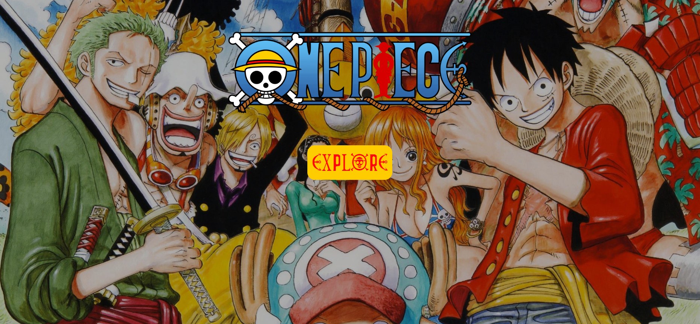
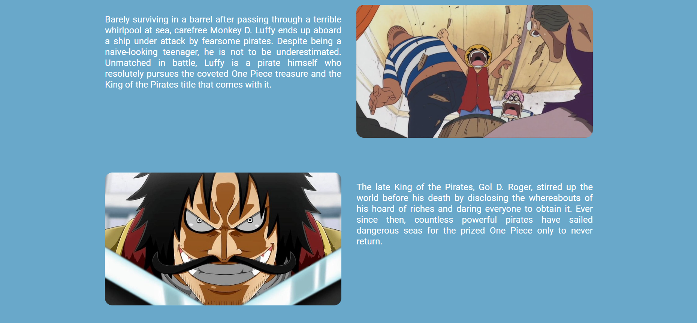
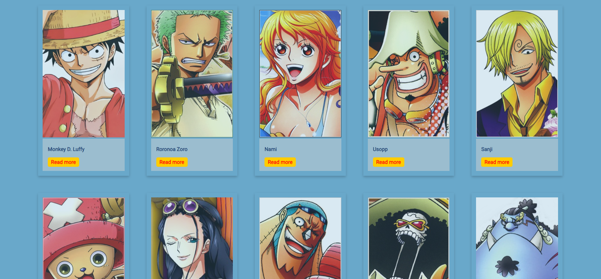
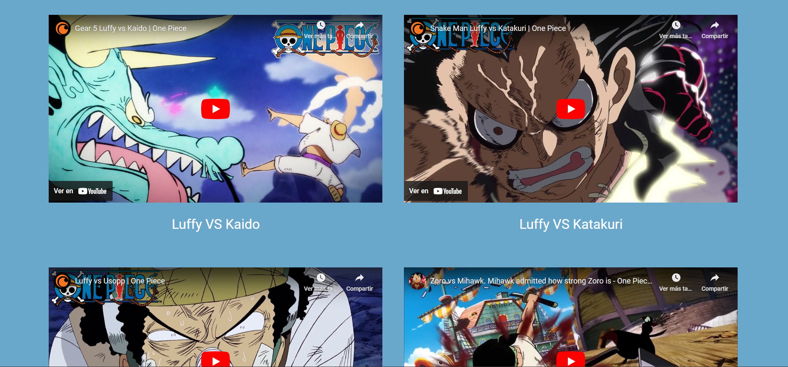
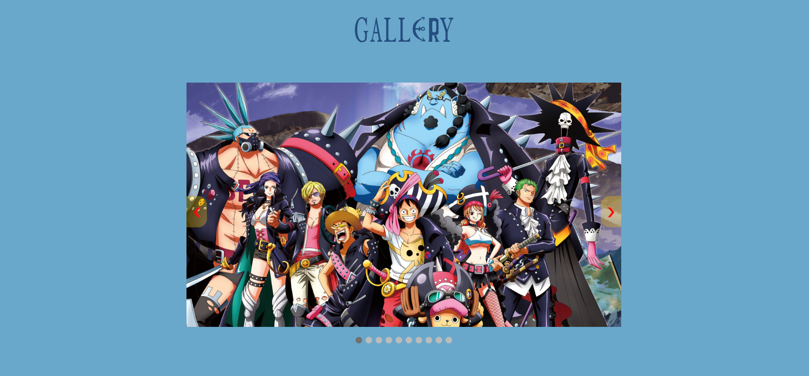
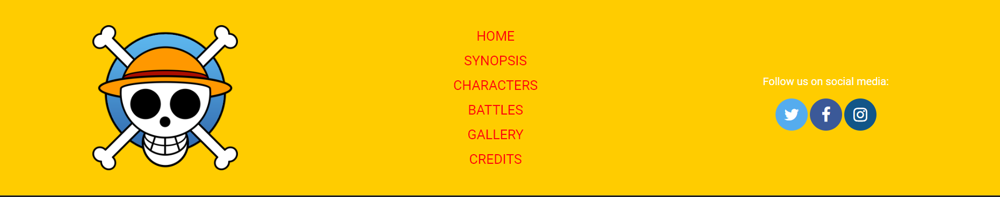
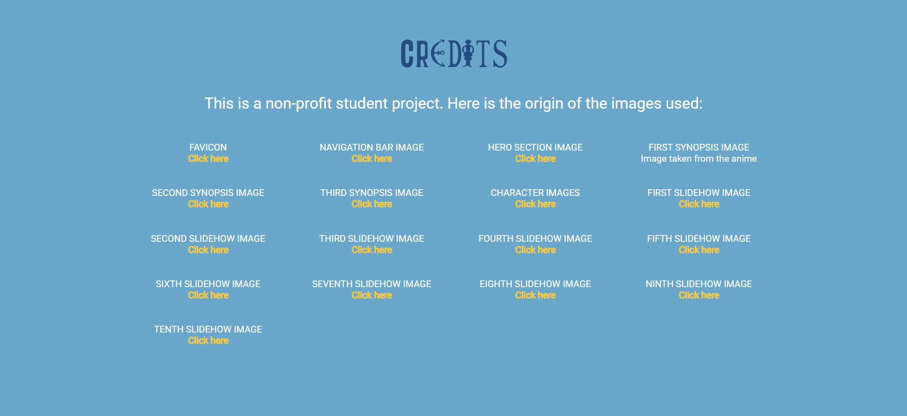

# ONE PIECE PROJECT 👒⚔🏴‍☠️🌊

Welcome nakamas! This repository hosts the development of a website dedicated to this exciting anime and manga. Here, we present a detailed description of the main sections it contains.

## 📚 Index
<ul>
  <li><a href="#introduction">Introduction</a></li>
  <li><a href="#motivation">Motivation</a></li>
  <li><a href="#structure">Structure</a></li>
  <li><a href="#style">Style</a></li>
  <li><a href="#snippets">Code snippets</a></li>
</ul>

<h2 id="introduction">🌟 Introduction</h2>

Project done by: Eloy Leiva López

Free theme web project for the 1st evaluation of Markup Languages

December 2023

<h2 id="motivation">🔥 Motivation</h2>

I have chosen the topic about One Piece because I really like anime in general, I just finished watching this one and I think it is the typical one that must be seen.

<h2 id="structure">🏗️ Structure</h2>

The website is divided into 7 sections:

🚀 1. Hero Section

📖 2. Synopsis

👤 3. Characters

⚔️ 4. Battles

🖼️ 5. Gallery

👣 6. Footer

📜 7. Credits

<h3>🚀 1. Hero Section</h3>

I have used a background image of Luffy's crew that easily adapts to different devices. Above it I have placed a Call to Action that directs us to the Synopsis section.

<h3>📖 2. Synopsis</h3>

The Synopsis section provides a complete and concise narrative of the storyline. From Monkey D. Luffy's humble beginnings to even the explanation of his curious abilities, this section will be the essential guide for newcomers and a refreshing review for veterans.

<h3>👤 3. Characters</h3>

Discover more about the fascinating characters that bring One Piece to life. Each profile will provide detailed information about the character's history, abilities, and contributions to the storyline.

<h3>⚔️ 4. Battles</h3>

The Battles section will highlight the most epic and thrilling showdowns in One Piece. From Luffy's fights to duels between powerful warriors, this area will offer detailed videos from the bests confrontations.

<h3>🖼️ 5. Gallery</h3>

Explore the rich collection of images and artwork from One Piece in the Gallery. From official illustrations to outstanding fan art, this section is a visual feast for fans.

<h3>👣 6. Footer</h3>

Follow the official One Piece social networks so you don't miss the last detail. From here you can access the credits section.

<h3>📜 7. Credits</h3>

Check this section for know the origin of all the images used.

<h2 id="style">Style</h2>
<h3>🎨 Color palette</h3>
<ul>
  <li>60% 🔵</li>
  <li>30% 🟡</li>
  <li>10% 🔴</li>
</ul>

<h3>🖋️ Fonts</h3>
<ul>
  <li>Titles: One Piece</li>
  <li>Text: Roboto</li>
</ul>

<h3>📷 Images</h3>

All images have been taken from Internet (You can check the "Credits" section for know the origin of the images used).

<h3>🎥 Videos</h3>
All videos have been taken from YouTube.

<h2 id="snippets"> 💻Code snippets</h2>
<ul>
  <li>Nav: <a href="https://www.w3schools.com/howto/howto_js_topnav.asp">From w3Schools "How to"</a></li>
  <li>Slideshow: <a href="https://www.w3schools.com/howto/howto_js_slideshow.asp">From w3Schools "How to"</a></li>
  <li>Smooth scroll snippet: <a href="https://www.w3schools.com/howto/howto_css_smooth_scroll.asp">From w3Schools "How to"</a></li>
  <li>Accordion: <a href="https://www.w3schools.com/howto/howto_js_accordion.asp">From w3Schools "How to"</a></li>
</ul>

We hope you enjoy exploring this One Piece website!👒🏴‍☠️

© *This is a non-profit student project. You can check the "Credits" section for know the origin of the images used.* ©
